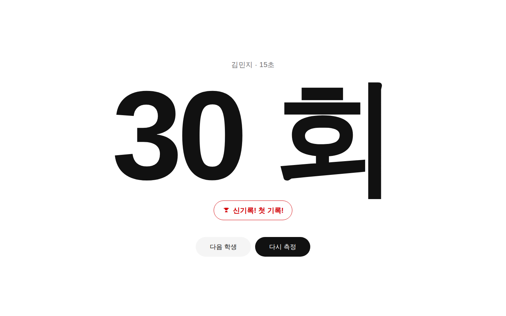
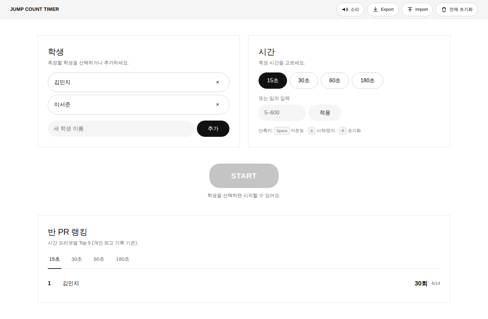
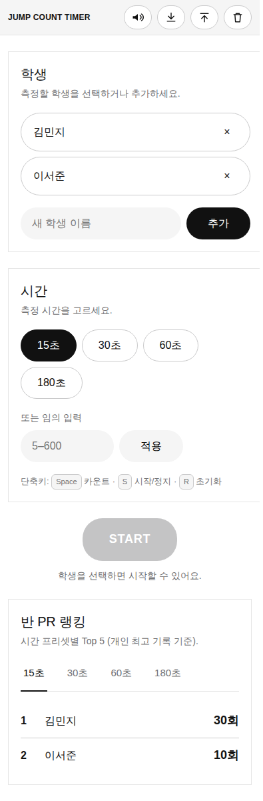

# Day 33 · 점프 카운트 타이머 (체육)

> 1일 1바이브코딩 Day 33 · 토픽 #033

체육 시간에 30초·1분 동안 줄넘기·제자리 점프 횟수를 학생이 스페이스바 또는 큰 화면 탭으로 카운트하고, 즉석에서 개인 최고기록(PR) 갱신 여부를 확인하는 **풀스크린 카운터**입니다. 교실 TV(1920×1080)와 노트북·태블릿 모두에서 가독성 있게 보이도록 풀스크린 거대 숫자(최대 약 30vw)로 표시합니다.

## 핵심 기능

- **시간 프리셋** — 15·30·60·180초 + 5~600초 임의 입력
- **카운트 입력** — 스페이스바 / 화면 탭 두 방식 모두 지원, 50ms 디바운스(빠른 학생 누락 없음)
- **풀스크린 카운터** — 측정 중 거대 숫자 + 남은 시간 + 4·3·2·1 카운트다운 + 시작·종료 Web Audio 비프음
- **학생 PR 보드** — 학생별·시간 프리셋별 최고 기록을 localStorage에 저장. 신기록은 빨간 트로피 카드로 즉시 표시
- **반 랭킹** — 15·30·60·180초 부문별 Top 5
- **JSON Export / Import** — 학기 내내 누적된 PR을 다른 PC로 옮기거나 백업
- **접근성** — 모든 버튼 48px+ 터치 타깃, focus-visible, aria-live 카운터·결과, `prefers-reduced-motion` 존중, 키보드 단축키 (Space / S / R / Esc)

## 배제 기능 (의도적 미포함)

- 카메라 자동 카운트 (개인정보 / 토픽 명시 금지)
- 외부 공유·서버 동기화 (모든 데이터 로컬 only)
- AI / 외부 API (Gemini 미사용)
- 로그인 / 계정 / 텔레메트리

## 실행 방법

### 온라인
👉 **[Live demo](https://989-alt.github.io/project-33-jump-count-timer/)**

### 로컬
```bash
git clone https://github.com/989-alt/project-33-jump-count-timer.git
cd project-33-jump-count-timer
python3 -m http.server 5180
# → http://localhost:5180
```

또는 `index.html`을 브라우저에서 직접 열어도 동작합니다 (file:// 경로).

### Playwright e2e 테스트
```bash
pip install playwright && python3 -m playwright install chromium
python3 -m http.server 5180 &
python3 tests/e2e.py
```

## 스크린샷


*신기록 결과 화면 — Nike 디스플레이 톤으로 30회를 화면 가득*


*메인 화면 — 학생/시간 선택, START, 반 PR 랭킹*


*모바일(390px) 뷰 — 1열 정리, 단축키 힌트 유지*

## 디자인 시스템

- **브랜드**: **Nike** (스포츠 / 체육에 1순위 추천된 design.md)
- **컬러**: 흑(`#111`) · 백(`#fff`) · soft-cloud(`#f5f5f5`) 3색만 chrome. **신기록**에만 sale red(`#d30005`).
- **타이포**: 시스템 sans-serif (Helvetica Neue → Inter → Pretendard → Apple SD Gothic Neo → Noto Sans KR fallback). 디스플레이는 `font-feature: "tnum"`로 자릿수 흔들림 제거.
- **컴포넌트**: 모든 CTA = pill (`border-radius: 30px`), 카드 = flat·no shadow·1px hairline divider, 8px 베이스 spacing.
- design.md 가이드 충돌 시 design.md 우선 + ui-ux-pro-max 접근성 규칙 보강.

## 적용한 skill (1일 1바이브코딩 v2)

| 단계 | Skill | 산출물 |
|---|---|---|
| Brainstormer | `brainstorming/SKILL.md` | `docs/plans/01-brainstorm.md` (MUST 4 / SHOULD 3 / MUST NOT 3) |
| UI/UX Designer | `ui-ux-pro-max/SKILL.md` + design.md(Nike) | `docs/plans/02-ui-ux.md` |
| Full Stack Dev | `senior-devops/SKILL.md` (코드 작성·디버깅으로 재정의) | `index.html` · `styles.css` · `app.js` (vanilla, CDN 의존 0) |
| Tester | `webapp-testing/SKILL.md` + Playwright | `tests/e2e.py` (18-step 시나리오), 2 사이클로 PASS |

## 기술 스택

- **HTML / CSS / JavaScript** (vanilla, 빌드 단계·번들러 없음)
- **localStorage** — 학생 / PR / 환경설정 저장
- **Web Audio API** — 시작 카운트다운·종료 비프
- **외부 의존성 0건** — CDN/네트워크 fetch 일절 없음

## 데이터 / 개인정보

- 모든 데이터는 브라우저 `localStorage`에만 저장됩니다.
- 외부로 전송되는 정보는 없습니다 (분석·CDN·트래커 0건).
- "전체 초기화" 버튼으로 즉시 삭제 가능.
- Export 파일(`jump-count-pr-YYYY-MM-DD.json`)은 사용자가 직접 다운로드해야 생성되며, 다른 PC로 옮기거나 백업하는 용도입니다.

## 라이선스

자유롭게 교실에서 사용·수정하세요. 이 프로젝트는 1일 1바이브코딩 챌린지의 결과물입니다.
